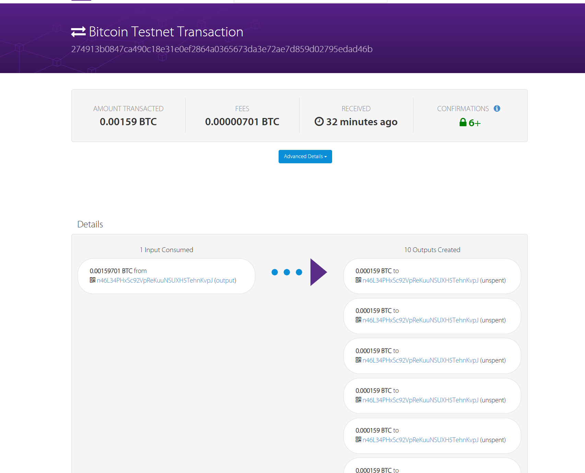
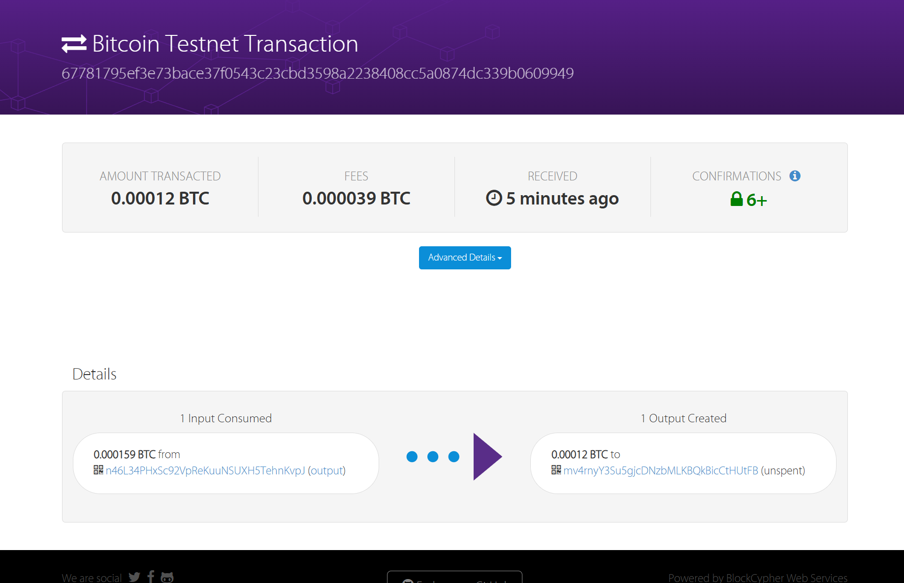

## 分币


```
(.venv) craftoldw@ACG5p-CraftOldW:~/1learningoutput/BlockChain/Ex1$ python3 ./split_test_coins\ .py 
201 Created
{
  "tx": {
    "block_height": -1,
    "block_index": -1,
    "hash": "274913b0847ca490c18e31e0ef2864a0365673da3e72ae7d859d02795edad46b",
    "addresses": [
      "n46L34PHxSc92VpReKuuNSUXH5TehnKvpJ"
    ],
    "total": 159000,
    "fees": 701,
    "size": 498,
    "vsize": 498,
    "preference": "low",
    "relayed_by": "50.7.253.114",
    "received": "2025-09-23T02:53:29.304769445Z",
    "ver": 1,
    "double_spend": false,
    "vin_sz": 1,
    "vout_sz": 10,
    "confirmations": 0,
    "inputs": [
      {
        "prev_hash": "9efb3ed09a0996ebbc105121cc5df23d0fabcc71e8a772272a112908adfc8f97",
        "output_index": 0,
        "script": "48304502210099e8e93fb62240033607377e36874c7b9e90ffc4140ff32d2de4c14e6cf5780b02204b8acde4b0675872ae156dac31f851b2321e604e730aa46cd2d363315249e8220121032fb32d53da5a76722f98322abf7f33e1af97c3edfb86d51eee8459f271e3224a",
        "output_value": 159701,
        "sequence": 4294967295,
        "addresses": [
          "n46L34PHxSc92VpReKuuNSUXH5TehnKvpJ"
        ],
        "script_type": "pay-to-pubkey-hash",
        "age": 4686638
      }
    ],
    "outputs": [
      {
        "value": 15900,
        "script": "76a914f7a2a4918942016fed27914f03fe977f067f7b8a88ac",
        "addresses": [
          "n46L34PHxSc92VpReKuuNSUXH5TehnKvpJ"
        ],
        "script_type": "pay-to-pubkey-hash"
      },
      {
        "value": 15900,
        "script": "76a914f7a2a4918942016fed27914f03fe977f067f7b8a88ac",
        "addresses": [
          "n46L34PHxSc92VpReKuuNSUXH5TehnKvpJ"
        ],
        "script_type": "pay-to-pubkey-hash"
      },
      {
        "value": 15900,
        "script": "76a914f7a2a4918942016fed27914f03fe977f067f7b8a88ac",
        "addresses": [
          "n46L34PHxSc92VpReKuuNSUXH5TehnKvpJ"
        ],
        "script_type": "pay-to-pubkey-hash"
      },
      {
        "value": 15900,
        "script": "76a914f7a2a4918942016fed27914f03fe977f067f7b8a88ac",
        "addresses": [
          "n46L34PHxSc92VpReKuuNSUXH5TehnKvpJ"
        ],
        "script_type": "pay-to-pubkey-hash"
      },
      {
        "value": 15900,
        "script": "76a914f7a2a4918942016fed27914f03fe977f067f7b8a88ac",
        "addresses": [
          "n46L34PHxSc92VpReKuuNSUXH5TehnKvpJ"
        ],
        "script_type": "pay-to-pubkey-hash"
      },
      {
        "value": 15900,
        "script": "76a914f7a2a4918942016fed27914f03fe977f067f7b8a88ac",
        "addresses": [
          "n46L34PHxSc92VpReKuuNSUXH5TehnKvpJ"
        ],
        "script_type": "pay-to-pubkey-hash"
      },
      {
        "value": 15900,
        "script": "76a914f7a2a4918942016fed27914f03fe977f067f7b8a88ac",
        "addresses": [
          "n46L34PHxSc92VpReKuuNSUXH5TehnKvpJ"
        ],
        "script_type": "pay-to-pubkey-hash"
      },
      {
        "value": 15900,
        "script": "76a914f7a2a4918942016fed27914f03fe977f067f7b8a88ac",
        "addresses": [
          "n46L34PHxSc92VpReKuuNSUXH5TehnKvpJ"
        ],
        "script_type": "pay-to-pubkey-hash"
      },
      {
        "value": 15900,
        "script": "76a914f7a2a4918942016fed27914f03fe977f067f7b8a88ac",
        "addresses": [
          "n46L34PHxSc92VpReKuuNSUXH5TehnKvpJ"
        ],
        "script_type": "pay-to-pubkey-hash"
      },
      {
        "value": 15900,
        "script": "76a914f7a2a4918942016fed27914f03fe977f067f7b8a88ac",
        "addresses": [
          "n46L34PHxSc92VpReKuuNSUXH5TehnKvpJ"
        ],
        "script_type": "pay-to-pubkey-hash"
      }
    ]
  }
}
```


## 将bitcoin返还



```
(.venv) craftoldw@ACG5p-CraftOldW:~/1learningoutput/BlockChain/Ex1$ python3 ./ex1.py 
201 Created
{
  "tx": {
    "block_height": -1,
    "block_index": -1,
    "hash": "67781795ef3e73bace37f0543c23cbd3598a2238408cc5a0874dc339b0609949",
    "addresses": [
      "n46L34PHxSc92VpReKuuNSUXH5TehnKvpJ",
      "mv4rnyY3Su5gjcDNzbMLKBQkBicCtHUtFB"
    ],
    "total": 12000,
    "fees": 3900,
    "size": 192,
    "vsize": 192,
    "preference": "low",
    "relayed_by": "50.7.253.114",
    "received": "2025-09-23T03:20:16.358702332Z",
    "ver": 1,
    "double_spend": false,
    "vin_sz": 1,
    "vout_sz": 1,
    "confirmations": 0,
    "inputs": [
      {
        "prev_hash": "274913b0847ca490c18e31e0ef2864a0365673da3e72ae7d859d02795edad46b",
        "output_index": 0,
        "script": "483045022100eaaca11bcfb4e7308df67d8a00d48d3a2f5037004857567cda5c4ca90330608d022035eb7afcf11abe0760bde7b944517959ec730088c8337e1bba4655790b51a99d0121032fb32d53da5a76722f98322abf7f33e1af97c3edfb86d51eee8459f271e3224a",
        "output_value": 15900,
        "sequence": 4294967295,
        "addresses": [
          "n46L34PHxSc92VpReKuuNSUXH5TehnKvpJ"
        ],
        "script_type": "pay-to-pubkey-hash",
        "age": 4703758
      }
    ],
    "outputs": [
      {
        "value": 12000,
        "script": "76a9149f9a7abd600c0caa03983a77c8c3df8e062cb2fa88ac",
        "addresses": [
          "mv4rnyY3Su5gjcDNzbMLKBQkBicCtHUtFB"
        ],
        "script_type": "pay-to-pubkey-hash"
      }
    ]
  }
}
```